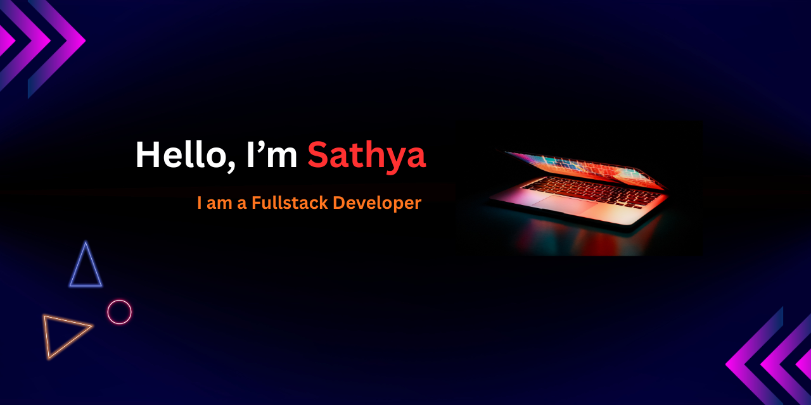

<h1 align="center">Hi 👋, Welcome All..💝</h1>

A Passionate Fullstack Developer

  

 

## 👨‍💻 About Me

- 💻 Currently working on **MERN Stack Development**
- 🌱 Currently learning **AI Full Stack Development**
- 💬 Ask me about **Frontend & Backend Technologies**
- 📍 Tirupur, India
- 🚀 Goal: Become AI Full Stack Developer

---

## 🚀 My Skills

  

---

## 🤝 Connect With Me

  
  
  

---

## ⚡ My Technical & All Over Skills

  
  
  
  
  
  
  
  
  
  
  
  
  
  
  
  

---

## 📊 GitHub Status

 

  

---

✨ Thanks for visiting my profile ✨

